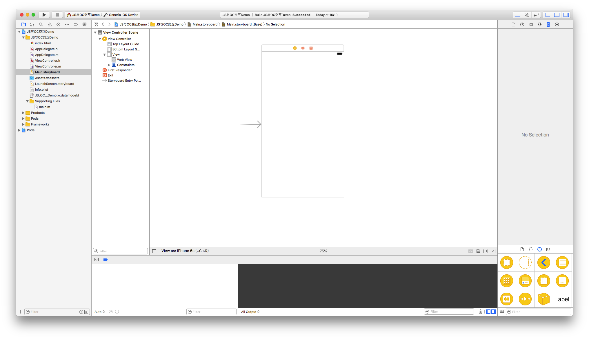
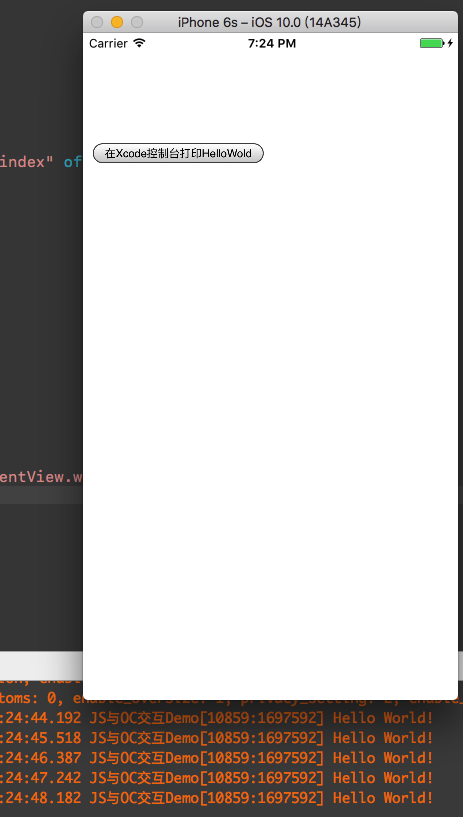
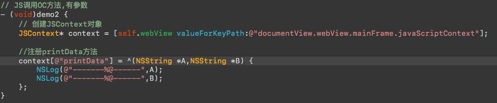
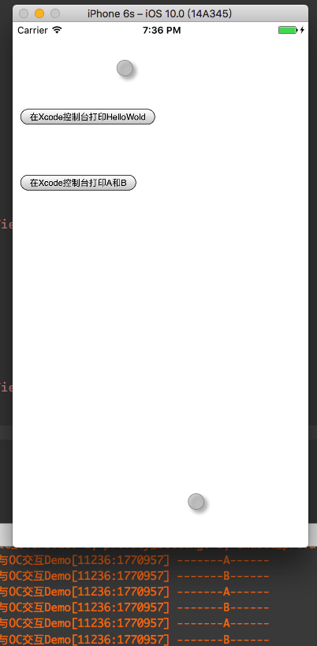
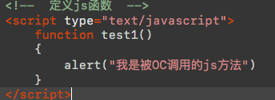
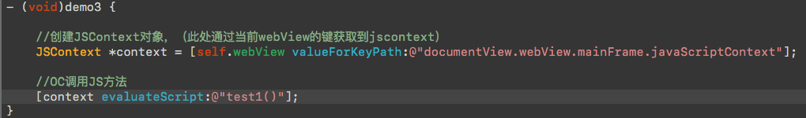
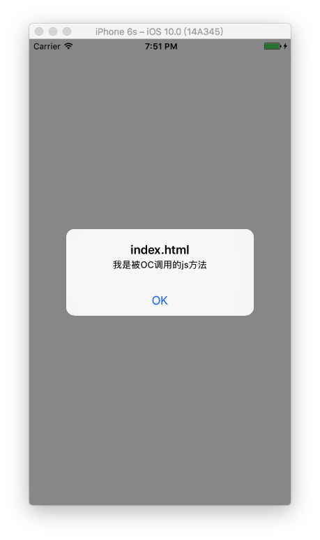
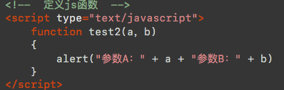
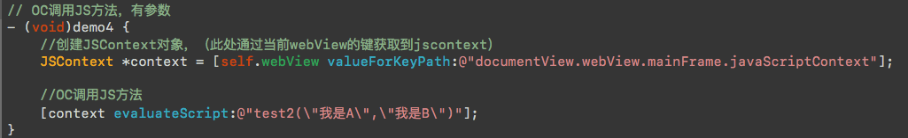
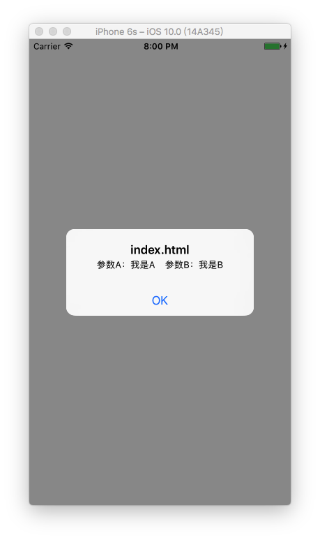

# IOS与JS通讯

---

最近做了一个项目需要用到JS与iOS通讯，在网上查阅资料后实现了功能。现在记录一下。如果有问题，欢迎指正。

---

## 目标

本文介绍网页JS（JavaScript）与IOS进行通讯。我们要实现：

* OC调用网页上面的方法 
* 网页调用IOS APP中方法

## JavaScriptCore.framework框架介绍

JavaScript框架允许OC\/C为基础的程序内对JavaScript程序进行赋值。也支持在本地程序中插入JavaScript环境。
详情请参考：[JavaScript](https://developer.apple.com/reference/javascriptcore)

## 创建项目

* 创建一个项目`JS与OC交互（名字可以自己定义）`的IOS工程。
* 为了方便直接在storyboard中添加一个UIWebView，设置好约束。
 
  
  
  
## 一、JS调用OC

### 1、无参数传递

* 首先没有传值的通讯
* 由于没有现成的网页，所以我们需要自己写一个测试网页。

```js
<!DOCTYPE html>
<html lang="en">
<head>
 <meta charset="utf-8">
 <title>JS与OC交互</title>
</head>
<body>
 <br /><br /><br /><br />
 <!-- 创建一个按钮，点击就调用 printHelloWorld() 方法 -->
 <button onclick="printHelloWorld()">在Xcode控制台打印HelloWold</button>
</body>
</html>

```

* 网页建立好后，进行IOS端代码编写：
* 需要导入JavaScriptCore.Framework

```objc
 - (void)viewDidLoad {
 [super viewDidLoad]；

 // 设置webView代理 
 self.webView.delegate = self;

 // 加载webView（注意：记得把html文件拖入工程中，否则在模拟器上运行是找不到的）
 NSString *path = [[NSBundle mainBundle] pathForResource:@"index" ofType:@"html"];

 // 加载html
 NSURL *url = [NSURL fileURLWithPath:path];
 NSURLRequest *request = [NSURLRequest requestWithURL:url];
 [self.webView loadRequest:request];
}

- (void)webViewDidFinishLoad:(UIWebView *)webView {
 NSLog(@"Web Load----------->Finish");
 [self demo1];
}

// JS调用OC方法
- (void)demo1 {

 // 创建JSContext对象
 JSContext* context = [self.webView valueForKeyPath:@"documentView.webView.mainFrame.javaScriptContext"];

 //注册printHelloWorld方法
 context[@"printHelloWorld"] = ^() {
 NSLog(@"Hello World!");
 };
}
```

运行在模拟器上结果：



### 2、有参数传递

* 有参数传递我们需要对html文件重新编辑，添加新的button
  
* 编辑OC代码
  
  
  >注意：需要将**`- (void)webViewDidFinishLoad:(UIWebView *)webView`**方法中添加`[self demo2]`
* 运行结果：
  

> 如果要传递更多的参数,依次在html和block里面对应的添加更多的参数即可！

还有一种是JS里面通过对象调用方法，此处不作说明，详情请见：[IOS js oc相互调用（JavaScriptCore）（二）](http://blog.csdn.net/lwjok2007/article/details/47058795)

## 二、OC调用JS

### 1、无参数

* 老规矩，重新编写html文件
  
* 添加一个OC方法
  
* 同样在`- (void)webViewDidFinishLoad:(UIWebView *)webView` 方法中添加`[self demo3]`

运行结果：


### 2、有参数传递

* html文件中添加：
  
* 添加一个OC方法：
  
  运行结果：
  

## 三、结语

这是我在一个OC与JS通讯的项目中学习的，可能会有错误，仅供参考，如果错误，欢迎指出。转载请随机，注明出处就好。

## 四、参考

[【iOS开发】网页JS与OC交互（JavaScriptCore）](http://www.jianshu.com/p/12c77d85b295)

