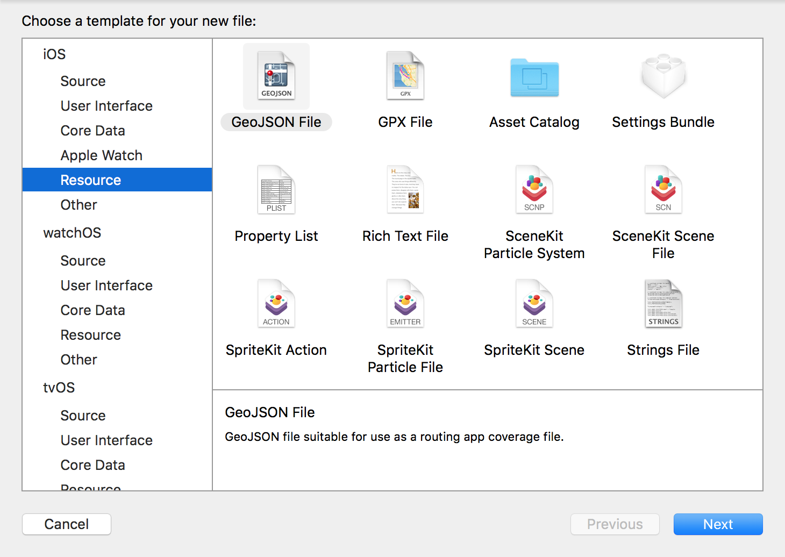
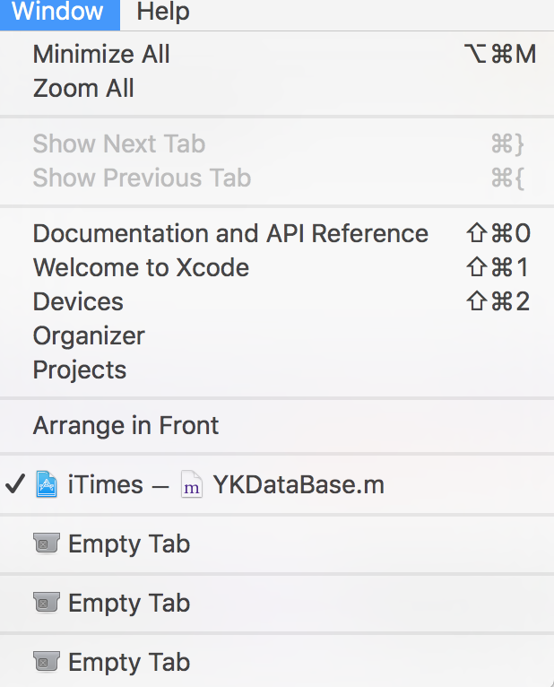
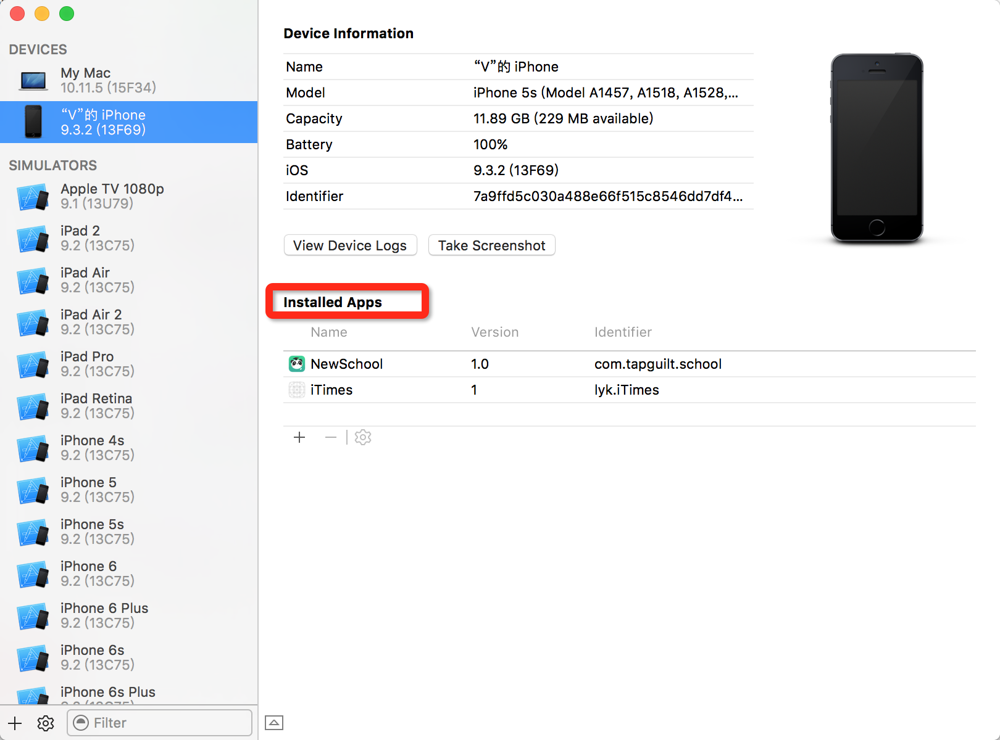
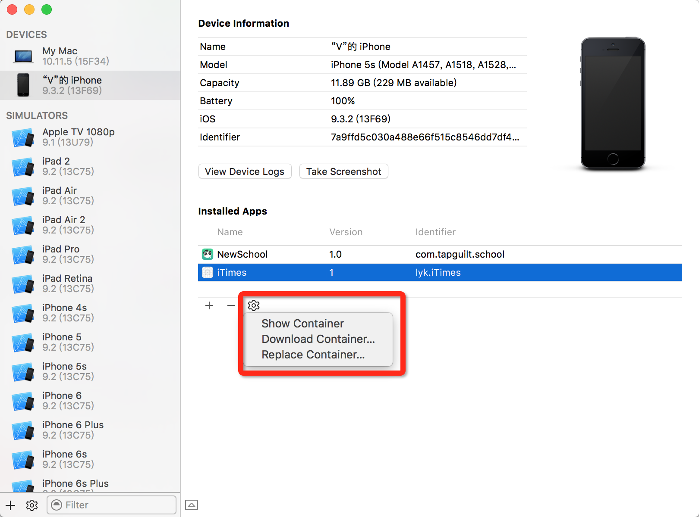

#IOS学习之plist文件的操作
##1、plist文件的创建—手动
在工程中按command +N快捷键创建，或者File —> New —> New File，选择任意平台（根据需要）下Resource下的Property List文件即可



---

##2、plist文件的创建—代码
利用代码创建plist文件首先获取创建路径：
```objc
    NSArray *arr;// 保存沙盒中document目录数组
    NSString *documents;// 保存沙盒下document目录路径
    NSString *filePath;// 保存沙盒下document目录plist文件路径
    NSMutableArray *rootArr;// 用于保存沙盒中数据
    
    rootArr = [[NSMutableArray alloc]init];
    arr = NSSearchPathForDirectoriesInDomains(NSDocumentDirectory, NSUserDomainMask, YES);
    documents = [arr objectAtIndex:0];
    filePath = [documents stringByAppendingPathComponent:@"dayData.plist"];
    rootArr = [NSMutableArray arrayWithContentsOfFile:filePath];// 读取沙盒中的数据（若目录文件不存在，会自动创建，执行此步才是真正创建plist文件）
```
> ```NSSearchPathForDirectoriesInDomains(NSDocumentDirectory, NSUserDomainMask, YES)```这个函数是用来获取沙盒下```Document```目录。除此之外沙盒中还有```Library```路径、```Caches```路径、```tmp```路径，具体作用自行谷歌，获取只需要将参数```NSDocumentDirectory```相应改成```NSLibraryDirectory```、```NSCachesDirectory```。**值得注意的是：**获取tmp目录需要
```objc
NSString*tmp=NSTemporaryDirectory();
```


##3、写入数据
```objc
  NSMutableDictionary *dict = [NSMutableDictionary dictionaryWithObjectsAndKeys:Num,@"编号",Date,@"日期",nil];
    [rootArr addObject:dict];// 向根数组中添加字典
    [rootArr writeToFile:filePath atomically:YES];// 向沙盒写入数据
```

## 4、读取数据
```objc
rootArr = [NSMutableArray arrayWithContentsOfFile:filePath];// 读取沙盒中的数据（若目录文件不存在，会自动创建）
然后根据数据类型自行调用
```
## 5、查看plist文件

1. 若是在模拟器中运行可以打印沙盒路径查看
2. 若是真机运行则需要Window→Devices选择自己的手机

3. 找到想要查看的APP，双击可以预览沙盒里面的内容，但是不能详细查看。
4.详细查看选择DownLoad，下载后，找到下载文件，右键-显示包内容，里面就有相应的沙盒文件。


##6、结语
这是本人在自己完成项目时遇到的问题所作笔记，欢迎指出错误，欢迎转载，转载请注明出处，谢谢！


