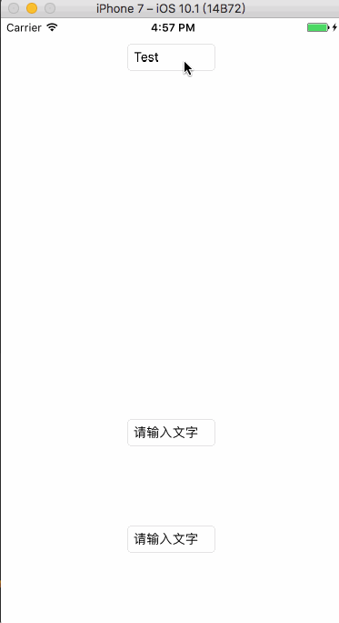
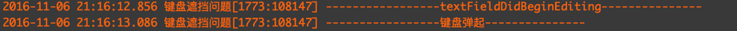

# 前言

* 今天在写实验室项目的时候，突然发现了点击靠近屏幕下部`UITextFiled` 的时候，键盘弹起会挡住输入框。在网上找了很多教程，大多数是把视图弹起高度写死，或者是没有对不需要弹起的输入框进行了错误的视图弹起，导致靠上的输入框移出视图。**但是！在IOS10中不同键盘高度是不同的！不同手机型号高度也不同！所以需要利用通知来动态获取键盘高度！**

* 先来看一下解决问题之后的Demo：


# 问题解决步骤

* 为了方便，我直接在storyBoard中拖了3个`UITextField`控件，两个靠下，一个靠上。
* 解决问题思路历程：
	- 首先是在注册键盘出现和隐藏通知的时候，分别添加两个方法，一个是视图弹起，一个是视图弹回。但是这个方法的缺陷是**无论输入框在哪里，只要键盘弹起，视图必定上弹，这就导致了靠视图上部的输入框也会弹起**，所以这个方案PASS掉。
		
	- 另一种方案是通过通知获取到键盘高度，然后在`UITextField `的代理方法`(void)textFieldDidBeginEditing:(UITextField *)textField`中首先对`textField.frame.origin.y`和键盘高度的差值进行判断，**如果差值大于0则上弹，如果小于0则不进行变化**。视图弹回则在`(void)textFieldDidEndEditing:(UITextField *)textField`中进行处理。**但是！！经过实际验证，`textField`的代理方法的执行在键盘通知之前**，如图：  所以这个方案也PASS掉。
	
	- 随后在网上查找解决方法，发现了[iOS 导航栏覆盖问题](http://halamyc.me/2015/09/19/iOS-%E5%AF%BC%E8%88%AA%E6%A0%8F%E8%A6%86%E7%9B%96%E9%97%AE%E9%A2%98/)这篇博文，为我提供了思路。  
	> ==可以利用一个对象来暂时保存被点击的`UItextFeild`，在通知调用方法的时候，进行输入框y值的判断，从而决定是否要更改视图。==
	
* 完整代码如下：

```objc
//
//  ViewController.m
//  键盘遮挡问题
//
//  Created by 柳钰柯 on 2016/11/6.
//  Copyright © 2016年 柳钰柯. All rights reserved.
//

#import "ViewController.h"

@interface ViewController ()<UITextFieldDelegate>
    
@property (weak, nonatomic) IBOutlet UITextField *textFieldOne;
@property (weak, nonatomic) IBOutlet UITextField *textFieldTwo;
@property (weak, nonatomic) IBOutlet UITextField *testField;
/** 暂时保存当前正在编辑的textField */
@property (strong, nonatomic) UITextField *tmpTextField;
/** 键盘尺寸 */
@property (assign, nonatomic) CGSize kbSize;
@end

@implementation ViewController

- (void)viewDidLoad {
    [super viewDidLoad];
    
    // 注册通知中心
    [self registerForKeyboardNotifications];
    
    // 设置代理
    self.textFieldOne.delegate = self;
    self.textFieldTwo.delegate = self;
    self.testField.delegate = self;
}

- (void)viewWillDisappear:(BOOL)animated{
    // 视图消失时移除通知
    [[NSNotificationCenter defaultCenter] removeObserver:self];
}

// 键盘弹回
- (void)touchesBegan:(NSSet<UITouch *> *)touches withEvent:(UIEvent *)event{
    [self.view endEditing:YES];
}

#pragma mark - 注册键盘通知中心获取键盘高度
// 注册键盘的通知中心
- (void)registerForKeyboardNotifications{
    // 键盘出现时的通知
    [[NSNotificationCenter defaultCenter] addObserver:self
                                             selector:@selector(keyboardWillShow:)
                                                 name:UIKeyboardWillShowNotification
                                               object:nil];
    // 键盘隐藏时的通知
    [[NSNotificationCenter defaultCenter] addObserver:self
                                             selector:@selector(keyboardWillHide:)
                                                 name:UIKeyboardWillHideNotification
                                               object:nil];
}

// 键盘弹起,视图上弹
- (void)keyboardWillShow:(NSNotification *)aNotification{
    NSDictionary *info = [aNotification userInfo];
    // kbSize键盘尺寸
    self.kbSize = [[info objectForKey:UIKeyboardFrameEndUserInfoKey] CGRectValue].size;
    NSLog(@"-----------------键盘弹起---------------");
    
    // 当前视图尺寸
    CGRect currentFrame = self.view.frame;
    CGFloat change = self.kbSize.height;
    currentFrame.origin.y = currentFrame.origin.y - change;
    
    // 弹起视图
    if (self.view.frame.origin.y >=0&&self.tmpTextField.frame.origin.y - change >0) {
        self.view.frame = currentFrame;
    }
}

// 键盘弹回，视图弹回
- (void)keyboardWillHide:(NSNotification *)aNotification{
    NSDictionary *info = [aNotification userInfo];
    // kbSize键盘尺寸
    self.kbSize = [[info objectForKey:UIKeyboardFrameEndUserInfoKey] CGRectValue].size;
    NSLog(@"键盘高度:%f",self.kbSize.height);
    
    // 当前视图尺寸
    CGRect currentFrame = self.view.frame;
    CGFloat change = self.kbSize.height;
    currentFrame.origin.y = currentFrame.origin.y + change;
    
    // 恢复视图
    if (self.view.frame.origin.y <0) {
        self.view.frame = currentFrame;
    }
}

#pragma mark - <UITextFieldDelegate>
- (void)textFieldDidBeginEditing:(UITextField *)textField{
    
    NSLog(@"-----------------textFieldDidBeginEditing---------------");
    self.tmpTextField = textField;
}
- (void)textFieldDidEndEditing:(UITextField *)textField{
    self.tmpTextField = nil;
}

@end

```

# 最后

* 感谢[Halamyc](http://halamyc.me)博主提供的思路。
* 如有错误，欢迎指正。随意转载，注明出处即可。

