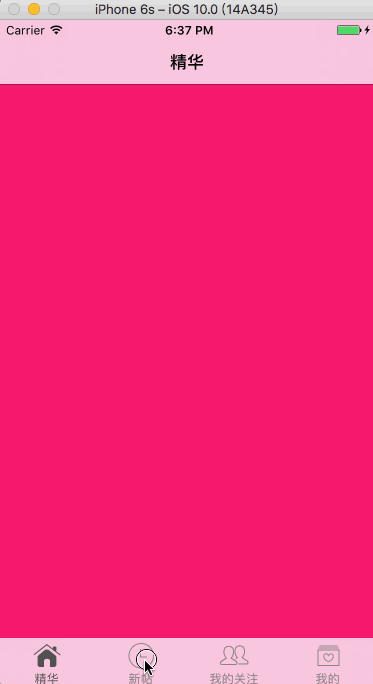

# 百思不得姐项目（一）

## 说明 

* 本文主要介绍百思不得姐项目框架的搭建
* 本文是博主在自己实战项目的一些笔记，如若有错，敬请指正！
* 我们要实现的内容如下：


## 前期准备

本文用到的第三方类库有：

* SVProgressHUD
* AFNetworking

我们可以使用cocoapods快速导入第三方类库，一些图片可以从[我的项目](https://github.com/Larrycal/-.git)中`Assets.xcassets`文件夹中拖入自己工程即可。

## 一、创建项目


创建好项目之后，我们需要对项目文件进行一个框架管理，文件目前共有5层结构：

1、Essence-精华

2、New-新帖

3、Me-我

4、FriendTrends-关注

5、Other-其他

每个文件根据MVC模式可以分为Model（模型）、View（视图）、Controller（控制器）
所以项目文件最终的结果如图：（PS：其他几个目录中文件为:Model、View、Controller,没有其他文件）。


当我们整理好项目目录之后，我们的Xcode会变成这样：

此时，将红色部分删除，然后再将我们的Classes文件夹拖入即可，最终效果如图：


## 二、创建初始化界面
由于界面是我们自己写的，所以我们不需要系统给我们建立的ViewController，直接删掉即可。
窗口的根控制器需要我们自己定义，在Other->其他->Controller文件夹下新建一个继承自UITabBarController的类。

在`AppDelegate.m`中导入头文件`#import "LaTabBarController.h"`并添加如下代码，更改初始化界面为我们自己的界面：

```objc
- (BOOL)application:(UIApplication *)application didFinishLaunchingWithOptions:(NSDictionary *)launchOptions {
    // 创建窗口
    self.window = [[UIWindow alloc] init];
    self.window.frame = [UIScreen mainScreen].bounds;
    
    // 添加子控制器
    self.window.rootViewController = [[LaTabBarController alloc] init];
    
    // 显示窗口
    [self.window makeKeyAndVisible];
    
    return YES;
}
```
同时去掉项目中默认的初始化界面：

删除main并回车。运行程序：

界面已经是我们自己定义的了，因为我们没有往其中添加东西，所以显示才为全黑。

## 三、配置TabBarController

我们自己的界面目前有4个——精华、关注、我的、新帖，所以我们都要对其创建新的控制器，方便我们以后的自定义操作，建立好的结果如图：


我们开始自己定义TabBarController，一些重复性操作我将其抽取到了`- (void)setUpChildVC:(UIViewController *)vc Title:(NSString *)title Image:(NSString *)image SelectImage:(NSString *)selectImage`函数中


```objc
//
//  LaTabBarController.m
//  百思不得姐
//
//  Created by 柳钰柯 on 2016/10/16.
//  Copyright © 2016年 柳钰柯. All rights reserved.
//

#import "LaTabBarController.h"
#import "LaEssenceViewController.h"
#import "LaFriendTrendsViewController.h"
#import "LaMeViewController.h"
#import "LaNewViewController.h"

@interface LaTabBarController ()

@end

@implementation LaTabBarController

+ (void)initialize{
    
    NSMutableDictionary *attrs = [NSMutableDictionary dictionary];
    attrs[NSFontAttributeName] = [UIFont systemFontOfSize:12];// 设置字体大小
    attrs[NSForegroundColorAttributeName] = [UIColor grayColor];// 设置正常按钮字体颜色
    
    NSMutableDictionary *selectAttrs = [NSMutableDictionary dictionary];
    selectAttrs[NSFontAttributeName] = [UIFont systemFontOfSize:12];
    selectAttrs[NSForegroundColorAttributeName] = [UIColor darkGrayColor];// 设置选中按钮字体颜色
    
    UITabBarItem *item = [UITabBarItem appearance];
    [item setTitleTextAttributes:attrs forState:UIControlStateNormal];
    [item setTitleTextAttributes:selectAttrs forState:UIControlStateSelected];
}

- (void)viewDidLoad {
    [super viewDidLoad];
    
    
    // 添加子控制器
    UIViewController *vc1 = [[LaEssenceViewController alloc]init];
    [self setUpChildVC:vc1 Title:@"精华" Image:@"tabBar_essence_icon" SelectImage:@"tabBar_essence_click_icon"];
    
    UIViewController *vc2 = [[LaNewViewController alloc]init];
    [self setUpChildVC:vc2 Title:@"新帖" Image:@"tabBar_new_icon" SelectImage:@"tabBar_new_click_icon"];
    
    UIViewController *vc3 = [[LaFriendTrendsViewController alloc]init];
    [self setUpChildVC:vc3 Title:@"我的关注" Image:@"tabBar_friendTrends_icon" SelectImage:@"tabBar_friendTrends_click_icon"];
    
    UIViewController *vc4 = [[LaMeViewController alloc]init];
    [self setUpChildVC:vc4 Title:@"我的" Image:@"tabBar_me_icon" SelectImage:@"tabBar_me_click_icon"];
    
    // 更换TabBar
    // [self setValue:[[LaTabBar alloc]init] forKeyPath:@"tabBar"];
}

/**
 * 添加子控制器
 */
- (void)setUpChildVC:(UIViewController *)vc Title:(NSString *)title Image:(NSString *)image SelectImage:(NSString *)selectImage{
    vc.navigationItem.title = title;// 设置导航栏标题
    vc.tabBarItem.title = title;// 设置按钮标题
    vc.tabBarItem.image = [UIImage imageNamed:image];// 设置按钮图片
    vc.tabBarItem.selectedImage = [UIImage imageNamed:selectImage];// 设置选中图片
    vc.view.backgroundColor = [UIColor colorWithRed:arc4random_uniform(255)/255.0
                                              green:arc4random_uniform(255)/255.0
                                               blue:arc4random_uniform(255)/255.0
                                              alpha:1.0]; // 设置背景颜色为了区别不同界面
    // 包装导航控制器,添加导航控制器为tabBarController的子控制器
    UINavigationController *navigationController = [[UINavigationController alloc] initWithRootViewController:vc];
    
    // 设置导航栏
    [self addChildViewController:navigationController];
}
@end
```

运行结果如图：


一些基本的`UITabBarController`已经配置完成，但是我们注意到在4个按钮中间有一个加号按钮，所以我们还需要对`TabBar`进行配置。在Other->View文件夹下建立一个名为LaTabBar的类：

在这个类里，我们需要添加中央的加号按钮

### 3.1 建立类扩展

> 注意：在这个类中，我使用了一些XXX.size、XXX.width等点方法，这个是在添加一个类扩展中，让我们更加方便的设置frame，设置方法如下：

*  建立类扩展 ：（PS：选择的时候不是再选择`Cocoa Touch Class`而是`Objective-C File`）


* 设置getter和setter等方法

`UIView+LaExtension.h`文件


```obcj
//
//  UIView+LaExtension.h
//  百思不得姐
//
//  Created by 柳钰柯 on 2016/10/12.
//  Copyright © 2016年 柳钰柯. All rights reserved.
//

#import <UIKit/UIKit.h>

@interface UIView (LaExtension)
@property(assign, nonatomic) CGSize size;
@property(assign, nonatomic) CGFloat width;
@property(assign, nonatomic) CGFloat height;
@property(assign, nonatomic) CGFloat x;
@property(assign, nonatomic) CGFloat y;

/** 在分类中声明@property，只会生成方法的声明，不会生成方法的实现和带有_下划线的成员变量 */
@end
```

`UIView+LaExtension.m`文件

``` objc
//
//  UIView+LaExtension.m
//  百思不得姐
//
//  Created by 柳钰柯 on 2016/10/12.
//  Copyright © 2016年 柳钰柯. All rights reserved.
//

#import "UIView+LaExtension.h"

@implementation UIView (LaExtension)

-(void)setSize:(CGSize)size{
    CGRect frame = self.frame;
    frame.size = size;
    self.frame = frame;
}

- (void)setWidth:(CGFloat)width{
    CGRect frame = self.frame;
    frame.size.width = width;
    self.frame = frame;
}

- (void)setHeight:(CGFloat)height{
    CGRect frame = self.frame;
    frame.size.height = height;
    self.frame = frame;
}

- (void)setX:(CGFloat)x{
    CGRect frame = self.frame;
    frame.origin.x = x;
    self.frame = frame;
    
}

- (void)setY:(CGFloat)y{
    CGRect frame = self.frame;
    frame.origin.y = y;
    self.frame = frame;
    
}

-(CGSize)size{
    return self.frame.size;
}

- (CGFloat)width{
    return self.frame.size.width;
}

- (CGFloat)height{
    return self.frame.size.height;
}

- (CGFloat)x{
    return self.frame.origin.x;
}

- (CGFloat)y{
    return self.frame.origin.y;
}

@end

```

### 3.2建立全局引用文件(.pch)

* 首先说一下pch的作用：

	1.存放一些全局的宏(整个项目中都用得上的宏)

	2.用来包含一些全部的头文件(整个项目中都用得上的头文件)

	3.能自动打开或者关闭日志输出功能
* 建立过程，在Other-其他文件夹中建立一个命名为Header的Header File的.h文件，创建完成之后右击它，点击Show in Finder，我们把`header.h`文件拖入终端中，得到它的路径

* 然后点击Target->Build Setting,在搜索框输入Prefix header,输入我们在终端中获取到的`header.h`文件的路径。注意：要将绝对路径转换为相对路径

  
### 3.3自定义TabBar


```objc
//
//  LaTabBar.m
//  百思不得姐
//
//  Created by 柳钰柯 on 2016/10/16.
//  Copyright © 2016年 柳钰柯. All rights reserved.
//

#import "LaTabBar.h"

@interface LaTabBar ()
// 发布按钮
@property(strong, nonatomic) UIButton *publishButton;
@end

@implementation LaTabBar

- (instancetype)initWithFrame:(CGRect)frame{
    if (self = [super initWithFrame:frame]) {
        // tabbar背景图片
        [self setBackgroundImage:[UIImage imageNamed:@"tabbar-light"]];
        UIButton *publishButton = [UIButton buttonWithType:UIButtonTypeCustom];
        [publishButton setBackgroundImage:[UIImage imageNamed:@"tabBar_publish_icon"] forState:UIControlStateNormal];
        [publishButton setBackgroundImage:[UIImage imageNamed:@"tabBar_publish_click_icon"] forState:UIControlStateHighlighted];
        publishButton.size = publishButton.currentBackgroundImage.size;
        [self addSubview:publishButton];
        self.publishButton = publishButton;
    }
    return self;
}

- (void)layoutSubviews{// 自动布局，在其中设置按钮frame等信息可以保持显示的和我们设置的是一致的
    [super layoutSubviews];
    
    CGFloat width = self.width;
    CGFloat height = self.height;
    
    // 设置发布按钮frame
    self.publishButton.center = CGPointMake(width * 0.5, height * 0.5);
    
    CGFloat buttonY = 0;
    CGFloat buttonW = width / 5;
    CGFloat buttonH = height;
    NSInteger index = 0;
    // 设置其他UITabBarButton的frame
    for (UIView *button in self.subviews) {
        if (![button isKindOfClass:NSClassFromString(@"UITabBarButton")])  continue;
        // 计算按钮的X值
        CGFloat buttonX = buttonW * ((index > 1) ? (index + 1):index);
        button.frame = CGRectMake(buttonX, buttonY, buttonW, buttonH);
        // 增加索引
        index++;
    }

}
@end

```

**配置完成TabBar后，进入`LaTabBarController.m`文件，在`viewDidLoad`函数中，利用KVC的方式替换默认的TabBar.(tabBar为ReadOnly,需要用KVC方式来替换)**

```objc
// 更换TabBar
    [self setValue:[[LaTabBar alloc]init] forKeyPath:@"tabBar"];
```

运行效果：


## 结尾

还有一部分内容放在（二）中讲解。
如有需要，随意转载，注明出处即可。
谢谢阅读。我的博客地址：[代码成诗](http://Larrycode.cc)