# 利用github page + jekyll 搭建个人博客
Github Pages 是面向用户、组织和项目开放的公共静态页面搭建托管服务，站点可以被免费托管在Github 上，你可以选择使用Github Pages 默认提供的域名github.io 或者自定义域名来发布站点。
## 说明
* 本文章仅做参考，每个人遇到的问题不一样，解决方法也不一样。请善用谷歌。
* 博客的主要目的不在于搭建，而在于坚持不懈的更新。
* 博主用的是MAC电脑，示例以OS X系统为准，windows系统操作也大致相同。

>Github Pages有以下几个优点：
> 
> * 轻量级的博客系统，没有麻烦的配置
> * 使用标记语言，比如Markdown
> * 无需自己搭建服务器
> * 根据Github的限制，对应的每个站有300MB空间
> * 可以绑定自己的域名
>
> 当然他也有缺点：
> 
> * 使用Jekyll模板系统，相当于静态页发布，适合博客，文档介绍等。
> * 动态程序的部分相当局限，比如没有评论，不过还好我们有解决方案。
> * 基于Git，很多东西需要动手，不像Wordpress有强大的后台

## 关于SSH Key
>SSH keys (简体中文) SSH 密钥对可以让您方便的登录到SSH 服务器，而无需输入密码。 由于您无需发送您的密码到网络中，SSH 密钥对被认为是更加安全的方式。 再加上使用密码短语(passphrase) 的使用，安全性会更上一层楼。


### 1、检查SSH Key
* 在终端中输入
```cd ~/.ssh
```

如果显示的是```No such file or directory```,则进行第三步；不是则执行第二步。

### 2、备份和移除原来的SSH Key设置
如果已经存在SSH Key的话，就需要对其进行备份并删除原有文件。
```
$ ls
config	id_rsa	id_rsa.pub	known_hosts
$ mkdir key_backup
$ cp id_rsa* key_backup
$ rm id_rsa*
```
如图所示：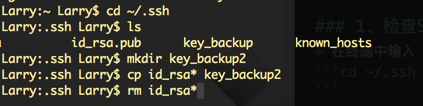

### 3、生成新的SSH Key
备份并移除旧的SSH Key之后，就可以生成新的SSH Key
```
$ ssh-keygen -t rsa -C "邮件地址@youremail.com"
Generating public/private rsa key pair.
Enter file in which to save the key (/Users/your_user_directory/.ssh/id_rsa):<直接回车，或者也可以自己输入路径>
```
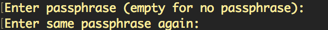
输入两次加密密钥后，就可以看到生成的SSH Key了。
如图所示就成功生成了：
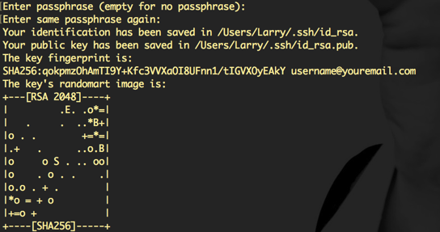

### 4、将新生成的SSH Key添加到github
* 首先进入github登录，点击个人头像->setting
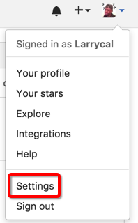

* 进入设置界面之后，点击SSH and GPG keys选项
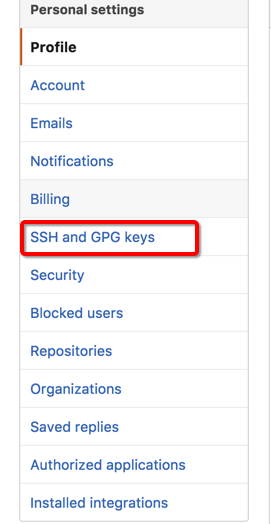

* 点击添加新的SSH Key
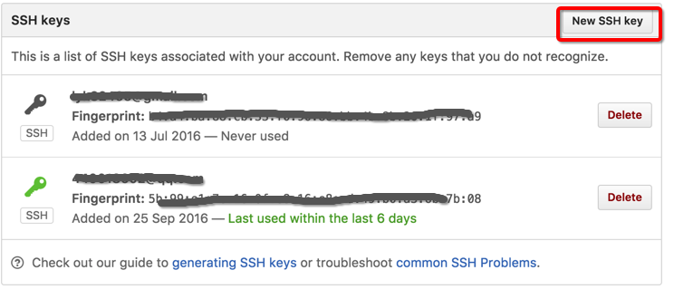

>添加新的SSH需要进入本地密钥文件，文件是隐藏的，MAC用户可以在Terminal中输入`defaults write com.apple.Finder AppleShowAllFiles YES`来显示隐藏文件。反之，若将`YES`改成`NO`则恢复隐藏

* 进入.ssh文件夹后，右键id_rsa.pub文件->打开方式->文本编辑器.app   复制里面所有内容添加到Key中,点击Add SSH Key.
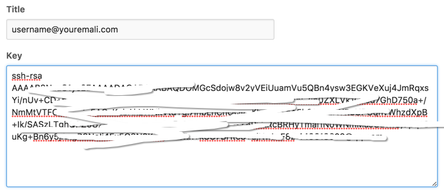

### 5、检测是否成功添加SSH Key
添加成功后在终端中输入`$ ssh -T git@github.com`来测试是否添加成功
如果出现```The authenticity of host 'github.com (207.97.227.239)' can't be established.
RSA key fingerprint is 16:27:ac:a5:76:28:2d:36:63:1b:56:4d:eb:df:a6:48.
Are you sure you want to continue connecting (yes/no)?
```输入YES就行。看到`Hi <em>username</em>! You've successfully authenticated, but GitHub does not provide shell access.`就代表成功了。

### 6、添加成功后的设置
添加SSH Key 成功后，需要输入：
```
$ git config --global user.name "你的名字"
$ git config --global user.email "your_email@youremail.com"
```
名字输入真名，邮箱输入github的邮箱。当你提交本地文件的时候，git会根据用户的名字和邮箱来记录提交，同时也是权限处理。

## 利用github page生成自己的博客
* 当连接好github之后，我们可以在github上建立自己的仓库。点击头像旁边的+号，选择new repository

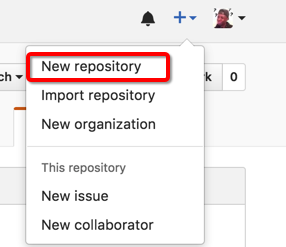

* 输入仓库名字，我输入的是`username.github.io`,勾选`Initialize this repository with a READEME`会自动为我们建立一个reademe.md文件，我们可以在其中添加自己的github的说明。
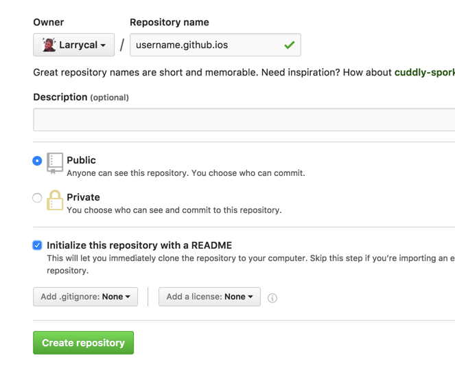

* 创建好仓库后，我们可以看见如下图所示界面，我们点击setting进入设置界面
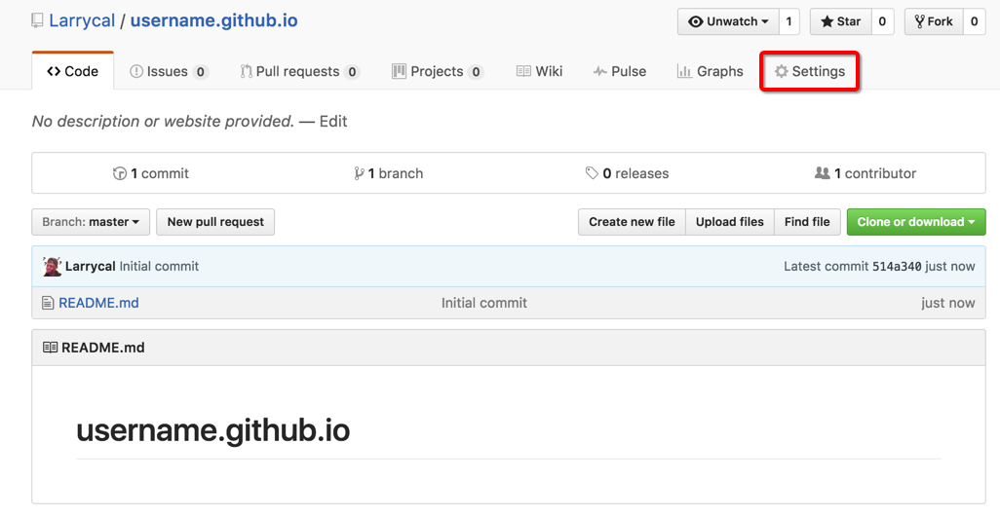

* 在设置界面中找到GitHub Pages，将source设置为master branch 点击保存。这样github page就会以我们上传在master分支中的页面为准。
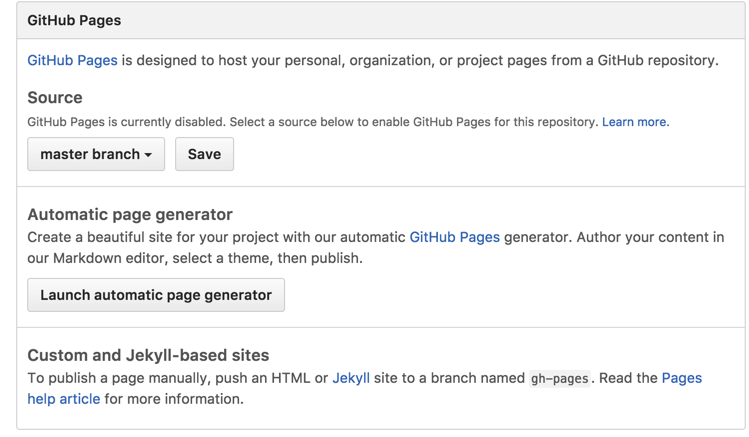

* 设置完成之后，点击页面如图所示。我们可以在Overwrite site中配置个人博客，点击Launch automatic page generator->continue to layouts->随便选择一款模板->Publish page
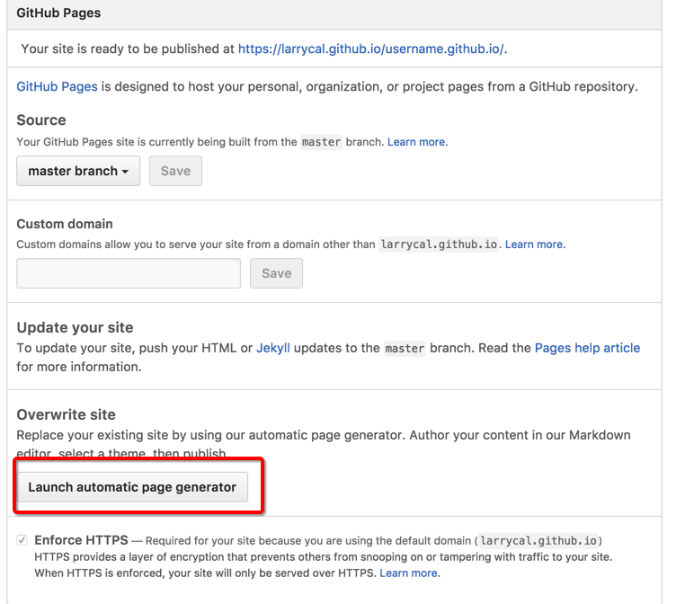
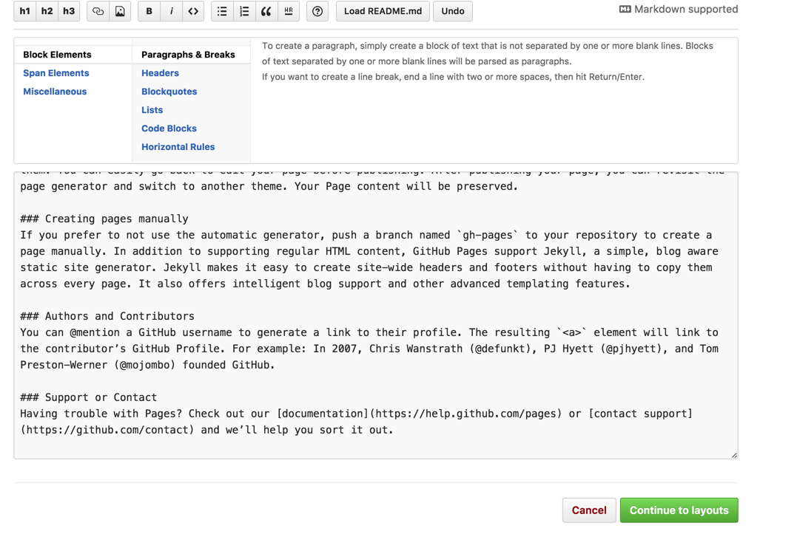
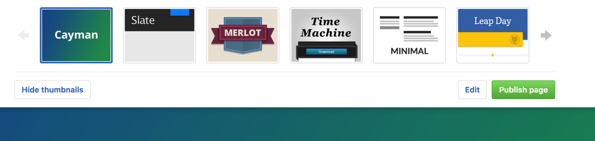
*至此，我们的github page已经配置完成* 我们可以点击`https://username.github.io/username.github.io/`访问自己的页面。

## 利用Jekyll模板
* 配置完成github page 之后，我们需要对页面重新进行排版。我们可以在[Jekyll模板站](http://jekyllthemes.org/)中找到自己喜欢的模板。例如我的是：[Moon](http://jekyllthemes.org/themes/moon/)，点击进入后，会有一些模板的介绍。
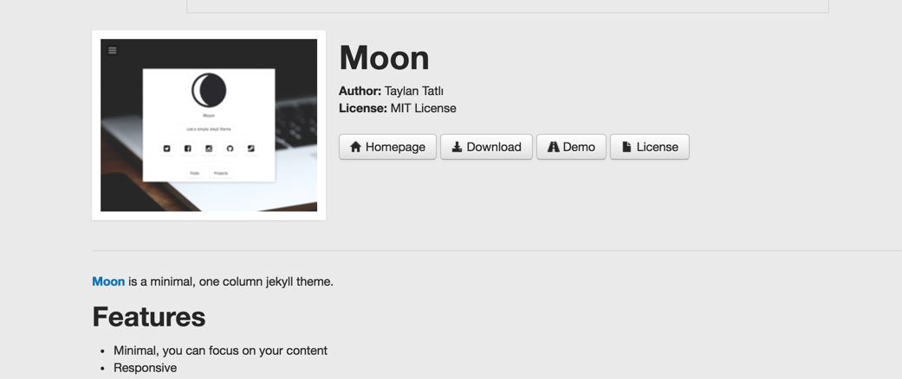
点击Demo可以预览模板，我们利用模板建立的页面就和Demo展示的一样。

* 选择自己喜欢的页面之后，点击下载（Download）。
* 要想利用下载好后的模板，需要把我们的github上的文件拉到本地。可以利用Terminal（终端）进行拉去，也可利用GitHub Desktop进行，推荐使用Desktop进行拉取，方便快捷。[GitHub Desktop下载戳此](https://desktop.github.com)
* 下载安装完成后，登录我们的github账号，点击+号->clone 选择我们刚刚建立的仓库username.github.io
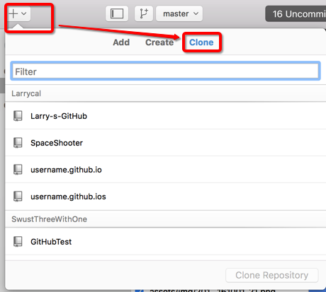
点击后，会让我们选择存放文件夹，按自己喜好选择。为了方便，我存放在桌面。
* 克隆下来之后，我们需要把文件夹里面的所有数据删除**注意不要将隐藏文件删除**，将刚才下载的模板文件解压到此文件夹。
* 解压后，发现我们的本地仓库多了很多Changes，输入描述之后（红框部分）点击Commit to master
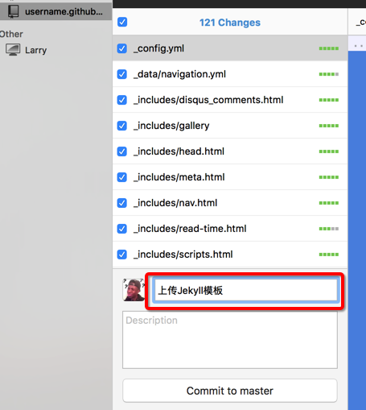
* 点击Sync同步到github,同步时间长短根据网络状态好坏而定。
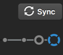
* 同步完成之后，再次进入我们的博客页面，发现我们的博客变成了和模板一模一样。接下来要做的就是修改模板，使其变成我们的博客。

## Jekyll结构说明
Jekyll 的核心是一个文本转换引擎。它的核心是把你零散的文件、文本组合起来，形成一个个网页，最终呈现在浏览器上展现出来。

一个最基础的 Jekyll 博客，会拥有下面的目录结构：

```.
├── _config.yml
├── _drafts
|   ├── begin-with-the-crazy-ideas.textile
|   └── on-simplicity-in-technology.markdown
├── _includes
|   ├── footer.html
|   └── header.html
├── _layouts
|   ├── default.html
|   └── post.html
├── _posts
│   └── 2013-08-07-welcome-to-jekyll.markdown
├── _site
└── index.html
```
**_config.yml**

配置文件，用来定义你想要的效果，设置之后就不用关心了。

**_includes**

可以用来存放一些小的可复用的模块，方便通过{ % include file.ext %}（去掉前两个{中或者{与%中的空格，下同）灵活的调用。这条命令会调用_includes/file.ext文件。

**_layouts**

这是模板文件存放的位置。

**_posts**

你的动态内容，一般来说就是你的博客正文存放的文件夹。他的命名有严格的规定，必须是2012-02-22-artical-title.MARKUP这样的形式，MARKUP是你所使用标记语言的文件后缀名，根据_config.yml中设定的链接规则，可以根据你的文件名灵活调整，文章的日期和标记语言后缀与文章的标题的独立的。

**_site**

这个是Jekyll生成的最终的文档，不用去关心。最好把他放在你的.gitignore文件中忽略它。如果没有本地安装jekyll环境，预览过自己的页面，一般是不会出现这个文件夹。

更多详细的内容请参考[jekyll帮助文档](http://jekyllrb.com/docs/configuration/)。

## 更改我们的模板
我们下载好的模板，上述东西都具有，`_site`文件夹除外。在我们下载的模板中，一般都会有详细的模板说明，怎么将模板更改成我们自己的。这里我就用我的模板（Moon）来举例。
用文本编辑器或者sublime text打开`_config.yml`

| 名字        | 含义           | 备注  |
| ------------- |:-------------:| :-----:|
| title      | 标题 | 在此处修改自己网页的标题，例如我的是：代码成诗 | 
| bio      | 对自己博客的一些描述      | 在此处修改博客首页显示的描述文字|
| description | 同上      | 此处的描述显示在About中 |
|.....|

还有更多的信息，请自行参考自己所用模板的说明，此处不一一赘述。
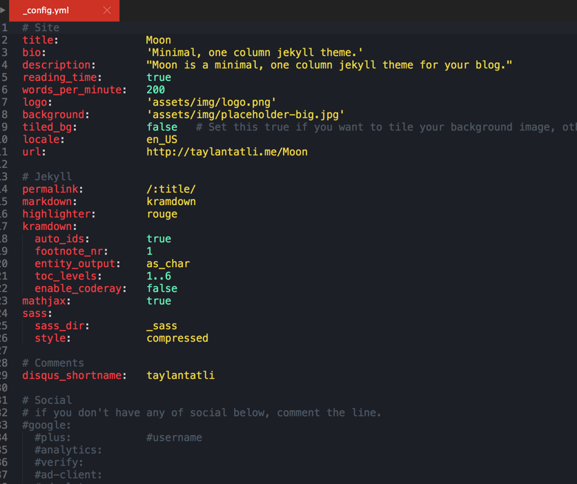
我修改好之后的`_config.yml`文件如图：

**还有更多的模板文件修改，请自行参考模板说明**

## 添加我们的博客
* 博客文件需要用markdown进行写作，通过文件命名也有严格的规范，一般以日期+博客标题命名。例如：2016-9-30-如何利用GitHub Page + Jekyll搭建自己的博客.md
* 在文档开头，需要添加

```.
---
layout: post
title: Blogging Like a Hacker
---
```
* 前后的---不能省略，在这之间，你可以定一些你需要的变量，layout就是调用_layouts下面的某一个模板，他还有一些其他的变量可以使用：

|变量|作用|
| ------------- |:-------------:|
|permalink|你可以对某一篇文章使用通用设置之外的永久链接|
|published |可以单独设置某一篇文章是否需要发布|
|category |设置文章的分类|
|tags |设置文章的tag|

* 上面的title就是自定义的内容，你也可以设置其他的内容，在文章中可以通过{ { page.title }}这样的形式调用。

* 模板变量，我们之前也涉及了不少了，还有其他需要的变量，可以参考官方的文档：[jekyll模板变量文档](https://github.com/mojombo/jekyll/wiki/template-data)
本篇文章的头部

```.
---
layout: post
title: "利用github page + jekyll 搭建个人博客"
date: 2016-09-26
excerpt: "Github Pages 是面向用户、组织和项目开放的公共静态页面搭建托管服务，站点可以被免费托管在Github 上，你可以选择使用Github Pages 默认提供的域名github.io 或者自定义域名来发布站点。"
tags: [博客,GitHub Page]
project:true
---
```

## 上传我们的博文
当博文写完之后，我们将md文件放在`_posts`文件夹中，这个文件夹专门用于存放博文。然后在GitHub Desktop中commit并同步，我们就可以在GitHub Page中看到我们写的博文啦！

## 最后
如果需要将我们的博客地址绑定到我们的独立域名，只需要购买域名后绑定到我们的GitHub Page即可。写了这么多，希望能帮到大家。才刚开始维护自己的博客，内容可能不够详实，有所错误。欢迎指正，联系邮箱在博客首页[我的博客地址](larrycode.cc)

参考博客：[使用Github Pages建独立博客](http://beiyuu.com/github-pages)


